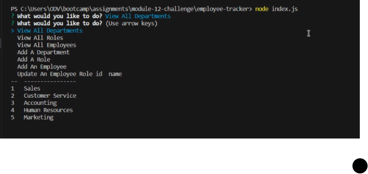
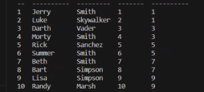

# Employee Tracker

# Description
- The motivation behind this project was to help a comapny keep track of its employees
- I built this project to help a company stay organized
- As companys get bigger, it gets harder to keep track of everyone. This app makes it easier to keep track of everyone
- Building this project helped me learn how to use mysql 

# Usage
- Start the app by typing "node index.js"
- Pick a command
- And done!

- Link to walkthroug video:[https://drive.google.com/file/d/1O6CIrSPg8s_H-7t03gZsKieU_85X2f1K/view]

